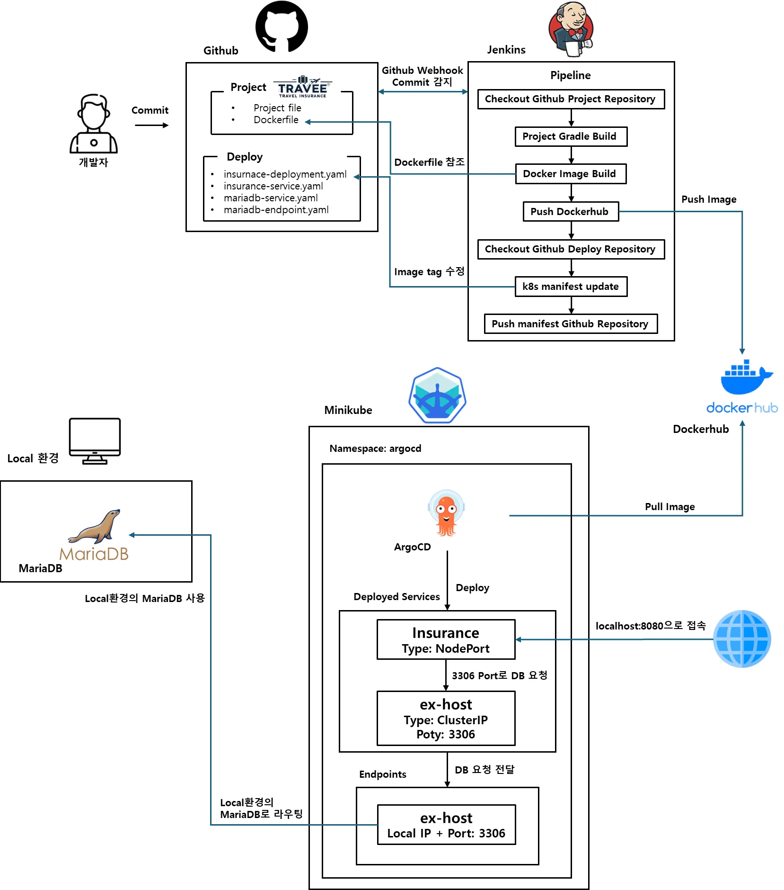

# Travee - 여행 보험 플랫폼

블록체인 기반 여행 보험 서비스

## 주요 기능

- 여행 보험 가입 및 관리
- 이더리움 지갑 연동
- 다국어 지원 (한국어, 영어, 일본어, 중국어, 프랑스어)
- 관리자 페이지
- 게시판 기능

## Kubernetes 배포

### CI/CD 흐름


> **GitHub → Jenkins → DockerHub → ArgoCD → Minikube**로 이어지는 자동 배포 파이프라인입니다.  
> 코드 커밋 시 자동으로 빌드·컨테이너화·배포되며, Kubernetes 환경에서 운영됩니다.


```bash
# 애플리케이션 배포
kubectl apply -f insurance-deployment.yaml
kubectl apply -f insurance-service.yaml

# 데이터베이스 설정
kubectl apply -f mariadb-service.yaml
kubectl apply -f mariadb-endpoint.yaml
```

## 환경변수 설정

Secret 생성이 필요합니다:
- `spring.datasource.url`
- `spring.datasource.password`
- `spring.mail.username`
- `spring.mail.password`
- `etherscan.api.key`
- `etherscan.contract.address`
- `metamask.private.key`

## 접속

- 서비스 포트: 5000 (NodePort)
- 컨테이너 포트: 8080
